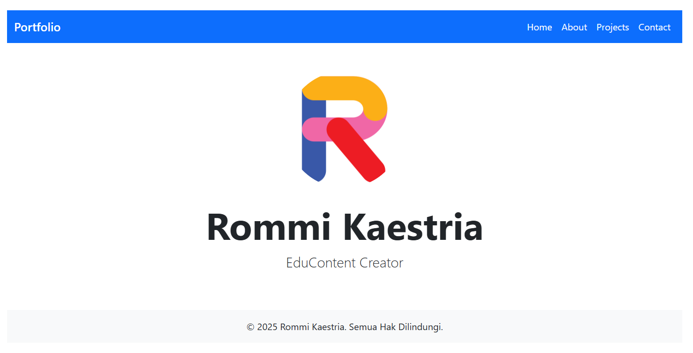

# Portfolio Vite Vue



Selamat datang di **Portfolio Vite Vue**! 🚀  
Proyek ini adalah portofolio pribadi yang dibangun menggunakan **Vue 3**, **Vite**, dan **Bootstrap 5**. Anda dapat menggunakan proyek ini untuk menampilkan informasi tentang diri Anda, pekerjaan, dan proyek-proyek Anda.

---

## 🎯 Fitur Utama
- **Navigasi Responsif**: Header dengan menu hamburger untuk layar kecil.
- **Halaman Dinamis**: Halaman seperti Home, About, Projects, dan Contact.
- **Desain Modern**: Menggunakan Bootstrap 5 untuk tampilan yang bersih dan responsif.
- **Gambar Profil**: Menampilkan gambar profil Anda di halaman utama.

---

## 📸 Tampilan Proyek
Berikut adalah tampilan dari halaman utama proyek ini:


---

## 🛠️ Teknologi yang Digunakan
- **Vue 3**: Framework JavaScript untuk membangun antarmuka pengguna.
- **Vite**: Build tool modern untuk pengembangan cepat.
- **Bootstrap 5**: Framework CSS untuk desain responsif.
- **JavaScript (ES6)**: Bahasa pemrograman utama.

---

## 📂 Struktur Proyek
Berikut adalah struktur folder utama proyek ini:

```plaintext
portfolio-vite-vue/
├── public/
│   └── images/ (opsional untuk file statis)
├── src/
│   ├── assets/ (gambar dan file statis lainnya)
│   │   └── profile-picture.png
│   ├── components/ (komponen seperti Header dan Footer)
│   ├── views/ (halaman seperti Home, About, Projects, Contact)
│   ├── App.vue (file utama aplikasi)
│   └── main.js (entry point aplikasi)
├── package.json (konfigurasi dependensi)
└── README.md (dokumentasi proyek)
```

---

## 🚀 Cara Menjalankan Proyek
Ikuti langkah-langkah berikut untuk menjalankan proyek ini di komputer Anda:

1. **Clone Repository**:
   ```bash
   git clone https://github.com/username/portfolio-vite-vue.git
   cd portfolio-vite-vue
   ```

2. **Instal Dependensi**:
   Pastikan Anda sudah menginstal **Node.js** di komputer Anda.
   ```bash
   npm install
   ```

3. **Jalankan Proyek**:
   ```bash
   npm run dev
   ```

4. **Buka di Browser**:
   Akses proyek di browser melalui URL:
   ```
   http://localhost:5173
   ```

---

## ✨ Halaman yang Tersedia
1. **Home**: Menampilkan gambar profil, nama, dan profesi Anda.
2. **About**: Informasi tentang diri Anda.
3. **Projects**: Daftar proyek yang pernah Anda kerjakan.
4. **Contact**: Formulir untuk menghubungi Anda.

---

## 📸 Gambar Profil
Gambar profil Anda disimpan di folder `src/assets`. Anda dapat mengganti gambar dengan file lain dan memperbarui path di file `Home.vue`:

```javascript
import profilePicture from '../assets/profile-picture.png';
```

---

## 📧 Kontak
Jika Anda memiliki pertanyaan atau ingin berkolaborasi, jangan ragu untuk menghubungi saya melalui halaman **Contact** di proyek ini.

---

## 🌟 Kontribusi
Jika Anda ingin berkontribusi pada proyek ini:
1. Fork repository ini.
2. Buat branch baru untuk fitur Anda:
   ```bash
   git checkout -b fitur-baru
   ```
3. Commit perubahan Anda:
   ```bash
   git commit -m "Menambahkan fitur baru"
   ```
4. Push ke branch Anda:
   ```bash
   git push origin fitur-baru
   ```
5. Buat Pull Request.

---

## 📜 Lisensi
Proyek ini dilisensikan di bawah [MIT License](LICENSE).

---

Terima kasih telah mengunjungi proyek ini! 😊
