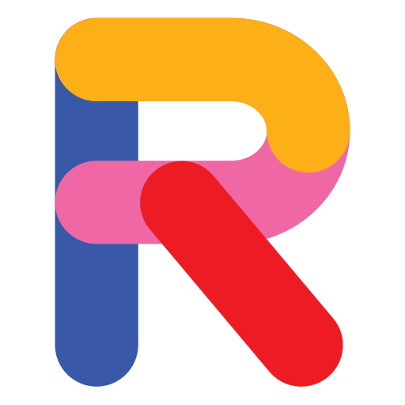

# Portfolio Vite Vue dengan PrimeVue



Selamat datang di **Portfolio Vite Vue**! 🚀  
Proyek ini adalah portofolio pribadi yang dibangun menggunakan **Vue 3**,
**Vite**, dan **PrimeVue**. Proyek ini menampilkan informasi personal,
keterampilan, dan proyek-proyek Anda dalam tampilan modern dan responsif.

## 🎯 Fitur Utama

- **UI Modern dengan PrimeVue**: Menggunakan komponen PrimeVue untuk tampilan
  profesional
- **Layout Responsif**: Tampilan optimal di semua ukuran perangkat
- **Navigasi Dinamis**: Menu responsif dengan mode mobile yang elegan
- **Tema Kustomisasi**: Mudah disesuaikan dengan tema PrimeVue

## 🛠️ Teknologi yang Digunakan

- **Vue 3**: Framework JavaScript progresif untuk UI
- **Vite**: Build tool yang sangat cepat untuk pengembangan modern
- **PrimeVue**: Library komponen UI premium untuk Vue
- **PrimeFlex**: Utility CSS untuk layout fleksibel
- **PrimeIcons**: Set ikon yang elegan

## 🚀 Cara Menjalankan Proyek

1. **Clone repository**
2. **Instal dependensi**: `npm install`
3. **Jalankan server development**: `npm run dev`
4. **Buka browser**: `http://localhost:5173`

## 📂 Struktur Proyek

```plaintext
portfolio-vite-vue/
├── src/
│   ├── assets/         # Gambar dan aset statis
│   ├── components/     # Komponen reusable (Header, Footer)
│   ├── views/          # Halaman utama aplikasi
│   ├── App.vue         # Root component
│   └── main.js         # Entry point aplikasi
└── package.json        # Dependencies dan scripts
```
